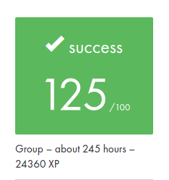

#  This project is part of my cursus at School 42 

# Live Demo: **<a src="https://ft-transcendence.pro">ft-transcendence.pro</a>**

## ft_transcendence : A Real-Time Multiplayer Pong Web Applicationk

## Overview
ft_transcendence is my final project at School 42. It’s a web-based multiplayer Pong game that brings together real-time gameplay, tournament systems, and live chat, all in a sleek Single-Page Application (SPA) format. Built with Django and Django REST on the backend and vanilla JavaScript/HTML/SCSS on the frontend, this project demonstrates full-stack capabilities, web security, and interactive gameplay design.

Live Demo: ft-transcendence.pro

## **Key Features**

- **Authentication**: Supports OAuth2 login via Google and School 42.

- **Profiles**: Users can create and manage profiles, including avatars and custom display names.
- **User Stats**: View game history, wins, losses, and detailed match history.
- **Friends**: Follow users, check their online status and their profiles.
- **Real-Time Chat**: Live messaging system using WebSocket, allowing direct messages and blocking users.

- **Game Modes**:
  - **1v1 Local Play**: Two players can play on the same computer.
  - **1v1 Online Play**: Play against friends or random users online.
  - **AI Mode**: Test your skills against an AI opponent.
  - **Tournament Mode**: Organize and participate in tournaments with up to four players.
  
- **Custom Game Router**: Custom-built SPA router and component system to navigate between views, as no front-end frameworks were allowed.
- **REST APIs**: Built using Django REST Framework to handle all game-related data (scores, user profiles, matchmaking, etc.).
- **Responsive Design**: Fully playable on all type of devices.

## **Technology Stack**

| Technology      | Description                                    |
|-----------------|------------------------------------------------|
| **Backend**     | Django + Django REST Framework                 |
| **Frontend**    | Vanilla JavaScript, HTML5, SCSS                |
| **Database**    | PostgreSQL                                     |
| **WebSocket**   | Real-time chat and game synchronization        |
| **OAuth2**      | Google and 42 School authentication            |
| **Containerization** | Docker for environment management          |
| **DevOps**      | Nginx for reverse proxy, HTTPS with SSL setup  |

## **Fun Features & Easter Eggs**
- **404 Pages**: I've added four different randomized 404 error pages for users to stumble upon, each with its own unique message.
- **Power-Ups**: When playing against AI or locally, you can press 'e' to reduce the size of the ball or 'f' or grow it. More hidden features may await discovery!

## **Gameplay Instructions**
- **Basic Controls**:  
  - Use arrow keys to move the paddle up and down.
  - Press 'Space' to pause the game.

## Rating

